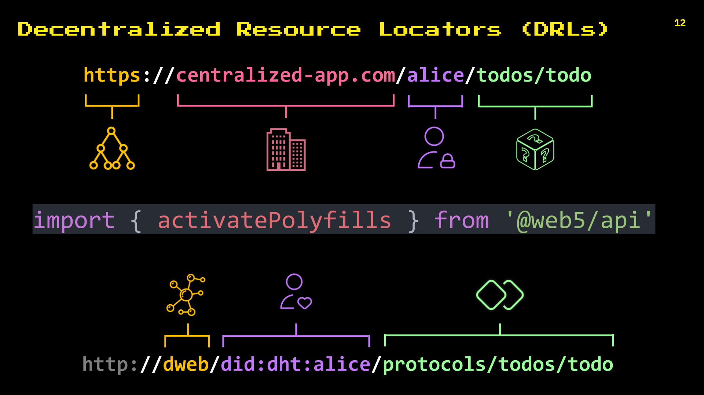

# Decentralized Package Manager (DPM)


Decentralized Package Manager (DPM) leverages decentralized identifiers (DIDs) to reference software packages stored on the DWeb as a record in the publisher's Decentralized Web Node (DWN).

## Goal

The goal of DPM is to ensure reliability and eliminate broken links by pointing to immutable sources. Instead of relying on centralized repositories like npm or Bun, DPM converts Decentralized Module Import (DMI) statements into Decentralized Resource Locators (DRLs) using a pre-defined convention and resolves the DRL to the location of the software on the DWeb.

## Summary

Npmjs packages are published under users and/or organizations. Users publish package names directly to npmjs while organizations can have a list of packages that roll up under the org umbrella.

* User: <npmjs.com/~bnonni>
* Organization: <npmjs.com/org/web5>
* Package: <npmjs.com/package/tool5>

On DPM, Users and Organizations are represented by their DID supporting DHT method. The `did:dht` resolves to the did document where the dwn endpoint should be present as a "service". DPM uses the DMI to build the DRL resolving the DID to get the DWN and query for the package record

* Packages are stored in the publisher's DWN using the DPM protocol
* DRLs are resolved using <https://github.com/TBD54566975/web5-js/blob/main/packages/api/src/web-features.ts>

## Decentralized Module Import (DMI)

* DRL resolution can be done in the browser context using [polyfills](https://github.com/TBD54566975/web5-js/blob/main/packages/api/src/web-features.ts).
* DMI resolution will be done by way of a loader script executioning some assumptions defined by a DMI-Resolver spec (Coming Soon!)
* DMI code reference

```ts
import * as Web5 from 'did:dht:@web5/package/api/0.0.1'
import * as Web5 from 'did:dht:@web5/package/api/0.0.1?hash=AIjFIKRllrhcb48dqUNAAZl0ig9'
```

## Decentralized Resource Locators (DRL)



## DPM Loader

Coming Soon!

## DPM Lockfile

The dpm.lock file contains the DRL@hashed-dwn-record-content to ensure the integrity of the software being installed. This approach guarantees that packages are always accessible and versioned securely, enabling a more resilient and trustworthy ecosystem for software distribution.

* After install, dpm will produce a file called `dpm.lock`
* The lockfile functions like a packge-lock.json: it locks each particular package to the specified version
* It contains all the converted DMIs in the form of DRLs with integrity hashes unique to each version
* The integrity hashes are the hash of the actual dwn record content (i.e. the code itself) returned from the query
* This is done to ensure the publisher cannot swap out code under a specific verion in the protocol path
* E.g. `DMI` => `DRL` :: `did:dht:web5/package/api/0.0.1` => `http://dweb/did:dht:web5/protocols/dpm/package/api/0.0.1`

```ts
{
    "did:dht:bnonni/package/dpm/0.0.1": {
        "version": "0.0.1",
        "resolved": "http://dweb/did:dht:bnonni/protocols/dpm/package/dpm/0.0.1",
        "integrity": "sha512-x/AIjFIKRllrhcb48dqUNAAZl0ig9+qMuN91RpZo3Cb2+zuibfh+KISl6+kVVyktDz230JKc208UkQwwMqyB+w==/VNCYsUA==",
        "license": "Apache-2.0"
    }
}
```

## Project Resources

| Resource                                   | Description                                                                    |
| ------------------------------------------ | ------------------------------------------------------------------------------ |
| [CODEOWNERS](./CODEOWNERS)                 | Outlines the project lead(s)                                                   |
| [CODE_OF_CONDUCT.md](./CODE_OF_CONDUCT.md) | Expected behavior for project contributors, promoting a welcoming environment |
| [CONTRIBUTING.md](./CONTRIBUTING.md)       | Developer guide to build, test, run, access CI, chat, discuss, file issues     |
| [GOVERNANCE.md](./GOVERNANCE.md)           | Project governance                                                             |
| [LICENSE](./LICENSE)                       | [![Apache License 2.0][apache-license-badge]][apache-license-link]            |

[apache-license-badge]: https://img.shields.io/badge/license-Apache%202.0-blue.svg
[apache-license-link]: https://opensource.org/licenses/Apache-2.0
